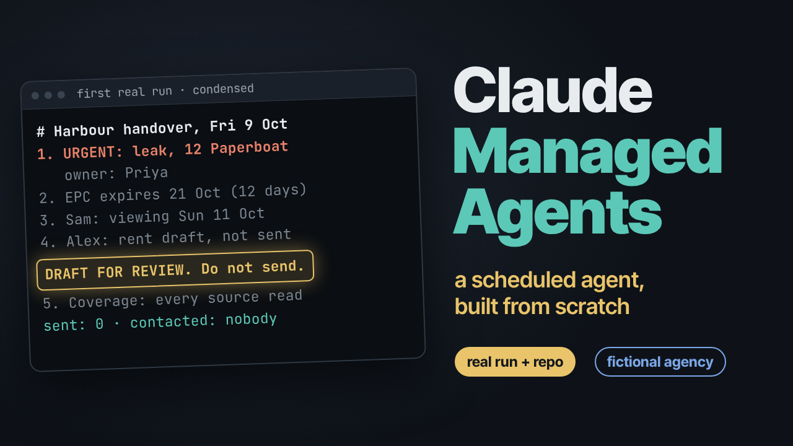

# Claude Managed Agents: Letty, a scheduled agent built from scratch

[](https://youtu.be/iereLgBDhAg)

**Video:** https://youtu.be/iereLgBDhAg

Every file from the video. Letty is a morning agent for **Harbour Lettings, a fictional letting agency**. All people, addresses and postcodes are invented, and ZZ postcodes do not exist. Each weekday at 07:32 London time, a Claude Managed Agents deployment would start a fresh session. Letty reads the agency's files and writes a short handover, a handoff for each colleague with something to do, and a rent reminder draft for review. She has no mailbox, no Slack token and no outbound network. Nothing leaves the building.

The layout follows Anthropic's [daily-brief reference](https://github.com/anthropics/claude-quickstarts/tree/main/managed-agents/daily-brief) from the post [Building effective agent automations](https://claude.dev/blog/building-effective-agent-automations/). The send step is taken out.

## What's in here

```
agents/letty.md                      the agent: model, two custom skills, web tools off, 11 run steps
skills/maintenance-triage/SKILL.md   urgent or routine, and who owns it
skills/certificate-renewals/SKILL.md gas safety (30 days), EICR (60 days), EPC (30 days) windows
environments/letty.yaml              cloud sandbox, limited networking, empty allow list
memory_stores/rules.yaml             read-only to Letty: rules.md, agency.json, inbox/
memory_stores/records.yaml           read-write: handover, handoffs, drafts, ledger, bookmarks, runs
deployments/morning-handover.md      schedule, memory, no vault, US$2.00 cap; the body is the first message
seed/                                fictional seed files (agency.csv is the same data as a table)
scripts/seed.sh                      writes the 3 seed files into the rules store after apply
scripts/show.sh                      prints one file from the records store
examples/first-run/                  everything Letty wrote on the run filmed in the video
```

## Before you start

- Claude Managed Agents is in **beta on the Claude Platform**. Access is on by default for Claude API accounts. It is not a feature of the Claude chat plans.
- You need a Claude API key (or `ant auth login`), the `ant` CLI and `jq`.
- Cost: tokens at the model's normal rates plus session runtime while a session is running. Each run in the video came in under US$0.10 at list price. The deployment's cap is `"200"` (US$2.00 per run). Check current prices on the [pricing page](https://platform.claude.com/docs/en/about-claude/pricing).
- `ant apply` creates a deployment that is **active**. Step 4 pauses it straight away. A paused deployment never fires on its schedule.

## Quick start

Every output below is from the run in the video. Your IDs will differ, and the model's wording can vary from run to run.

### 1. Install the ant CLI ([video 6:20](https://youtu.be/iereLgBDhAg?t=380))

What it does: installs Anthropic's official command-line tool. On macOS use `brew install anthropics/tap/ant`. On Linux:

```bash
VERSION=1.39.1
OS=$(uname -s | tr '[:upper:]' '[:lower:]')
case $(uname -m) in x86_64) ARCH=amd64 ;; aarch64) ARCH=arm64 ;; esac
curl -fsSL "https://github.com/anthropics/anthropic-cli/releases/download/v${VERSION}/ant_${VERSION}_${OS}_${ARCH}.tar.gz" \
  | sudo tar -xz -C /usr/local/bin ant
ant --version
```

Expected output:

```
ant version 1.39.1
```

Then log in with `ant auth login`, or export `ANTHROPIC_API_KEY` in your shell. Never commit a key.

### 2. Clone the repo ([video 6:20](https://youtu.be/iereLgBDhAg?t=380))

What it does: gets the files. Nothing exists on your account yet.

```bash
git clone https://github.com/schoolofai/claude-managed-agents-letty
cd claude-managed-agents-letty
find . -type f -not -path './.git/*' -not -path './examples/*' | sort
```

Expected output:

```
./agents/letty.md
./deployments/morning-handover.md
./environments/letty.yaml
./memory_stores/records.yaml
./memory_stores/rules.yaml
./scripts/seed.sh
./scripts/show.sh
./seed/agency.csv
./seed/agency.json
./seed/inbox/2026-10-08-leak.md
./seed/rules.md
./skills/certificate-renewals/SKILL.md
./skills/maintenance-triage/SKILL.md
```

(plus `LICENSE`, `README.md` and `.gitignore`)

### 3. Preview the plan ([video 6:31](https://youtu.be/iereLgBDhAg?t=391))

What it does: `ant apply` without `--yes` shows what it would create, then asks. Press `d` for details, then `n`. Nothing is created. The plan also prints the organization and workspace it will use.

```bash
ant apply deployments/morning-handover.md
```

Expected output (end of the plan):

```
+ ./skills/certificate-renewals      create
+ ./skills/maintenance-triage        create
+ ./environments/letty.yaml          create
+ ./memory_stores/records.yaml       create
+ ./memory_stores/rules.yaml         create
+ ./agents/letty.md                  create
+ ./deployments/morning-handover.md  create

Resources  + 7 to create

Apply these changes? (y)es / (n)o / (d)etails n
Aborted.
```

### 4. Apply, then pause straight away ([video 6:47](https://youtu.be/iereLgBDhAg?t=407))

What it does: creates the 7 resources in dependency order (skills first, because the agent needs their IDs) and writes their IDs to `claude-lock.json`. The new deployment starts active, so the next two commands pause it.

```bash
ant apply --yes deployments/morning-handover.md
DEPL=$(jq -r '.resources["./deployments/morning-handover.md"].id' claude-lock.json)
ant beta:deployments pause --deployment-id $DEPL --transform '{id,status,paused_reason}' -r
```

Expected output:

```
± Name                               Status
+ ./skills/certificate-renewals      created    skill_01...
+ ./skills/maintenance-triage        created    skill_01...
+ ./environments/letty.yaml          created    env_01...
+ ./memory_stores/records.yaml       created    memstore_01...
+ ./memory_stores/rules.yaml         created    memstore_01...
+ ./agents/letty.md                  created    agent_01...
+ ./deployments/morning-handover.md  created    depl_01...

Resources  + 7 created

State written to ./claude-lock.json
{
  "id": "depl_01...",
  "status": "paused",
  "paused_reason": {
    "type": "manual"
  }
}
```

`claude-lock.json` is in `.gitignore`. It holds your resource IDs, not secrets, but it belongs to your account.

### 5. Seed the rules store ([video 7:14](https://youtu.be/iereLgBDhAg?t=434))

What it does: `ant apply` creates the stores, not the files in them. This writes `rules.md`, `agency.json` and one inbox note into the read-only rules store.

```bash
scripts/seed.sh
```

Expected output:

```
/rules.md
/agency.json
/inbox/2026-10-08-leak.md
seeded the rules store: 3 files
```

### 6. Start one run by hand and watch it ([video 8:09](https://youtu.be/iereLgBDhAg?t=489))

What it does: starts one session now, even though the deployment is paused, and follows it live. The first message is the deployment file's body. Press Ctrl-C to detach when Letty goes idle. The run in the video took about half a minute of active work.

```bash
SESSION=$(ant beta:deployments run --deployment-id $DEPL --transform session_id -r)
echo $SESSION
ant beta:sessions connect $SESSION
```

Expected output: a session ID like `sesn_01...`, then a live view of Letty's tool calls and her final message. From the video:

```
The handover for Friday 9 October is written, with four items and one coverage line.
...
I left three things out of the handover:
- Lantern boiler (job-104): it is routine, heating still works and Pebble Heating is already on it.
  It appears as an FYI in Priya's handoff.
- Paperboat gas safety certificate: it expires 18 November, 40 days away, outside the 30-day window.
- Lantern EICR: it expires in April 2027, outside the 60-day window.
```

### 7. Read what she wrote ([video 8:47](https://youtu.be/iereLgBDhAg?t=527))

What it does: lists the records store, then prints the handover, Priya's handoff and Alex's draft. Use `--format jsonl` so `ant` prints lines instead of opening its interactive table.

```bash
REC=$(jq -r '.resources["./memory_stores/records.yaml"].id' claude-lock.json)
ant beta:memory-stores:memories list --memory-store-id $REC --transform path -r --format jsonl
scripts/show.sh /handover/latest.md
scripts/show.sh /handoffs/2026-10-09-priya.md
scripts/show.sh /drafts/2026-10-09-rent-paperboat-casey.md
```

Expected output (the file names use the run's date):

```
/runs/2026-10-09.md
/notes.md
/bookmarks.json
/ledger.md
/drafts/2026-10-09-rent-paperboat-casey.md
/handoffs/2026-10-09-alex.md
/handoffs/2026-10-09-sam.md
/handoffs/2026-10-09-priya.md
/handover/latest.md
```

The handover from the video ([full file](examples/first-run/handover/latest.md)):

```
# Harbour handover, Friday 9 October
1. URGENT: 12 Paperboat Lane (Casey Quinn) reported last night (8 Oct, 21:40) water still dripping from under the kitchen sink. Water leak = urgent. Owner: Priya Shah. No contractor is on this property in the file; no job exists yet.
2. Priya: 8 Gull Cottage EPC expires 21 Oct 2026, 12 days left. Chase the renewal.
3. Sam: viewing view-18 at 8 Gull Cottage, Sun 11 Oct, 11:00 (Nia Brooks, on your list).
4. Alex: 12 Paperboat Lane September rent is 14 days late. Reminder draft is in drafts/ for your review, not sent. Note the open leak report before anything goes to the tenant.
5. Coverage: read rules, agency.json, inbox (1 of 1 file, 2026-10-08-leak.md). Records were empty, so this is the first run; no bookmarks existed.
```

The draft for Alex starts `DRAFT FOR REVIEW. Do not send.` ([full file](examples/first-run/drafts/2026-10-09-rent-paperboat-casey.md)). Unprompted, Letty noticed that the tenant who owes rent also reported the leak, and told Alex to consider the timing. All nine files from that run are in [examples/first-run](examples/first-run).

The seed data is dated for 9 October 2026 (the leak note is from 8 October, the EPC expires 21 October). On a later date Letty works out "today" for herself, so her handover will differ. Edit `seed/` to move the dates.

### 8. Leave it paused, or clean up ([video 11:10](https://youtu.be/iereLgBDhAg?t=670))

What it does: keeps the schedule from ever firing, or removes what you created. Check that the deployment is still paused:

```bash
ant beta:deployments retrieve --deployment-id $DEPL --transform '{status,paused_reason}' -r
```

Expected output:

```
{
  "status": "paused",
  "paused_reason": {
    "type": "manual"
  }
}
```

Before you ever unpause it (`ant beta:deployments unpause`), lower the cap in `deployments/morning-handover.md`. The post's advice is 3 to 5 times a normal run. To tidy up, archive the deployment and the agent (`ant beta:deployments archive`, `ant beta:agents archive`), then delete the memory stores, the environment, and the skills (each skill version first, then the skill) with their `delete` commands. Run `ant beta:<resource> --help` to see them.

## Sources

- Anthropic, Building effective agent automations: https://claude.dev/blog/building-effective-agent-automations/
- Reference implementation: https://github.com/anthropics/claude-quickstarts/tree/main/managed-agents/daily-brief
- Claude Managed Agents overview: https://platform.claude.com/docs/en/managed-agents/overview
- ant CLI: https://platform.claude.com/docs/en/cli-sdks-libraries/cli

## License

MIT. The seed data is fictional.
